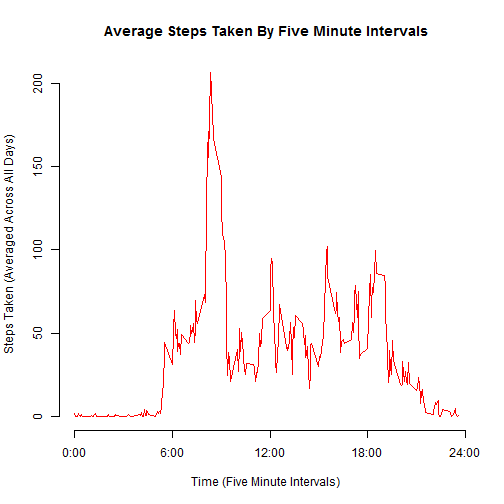
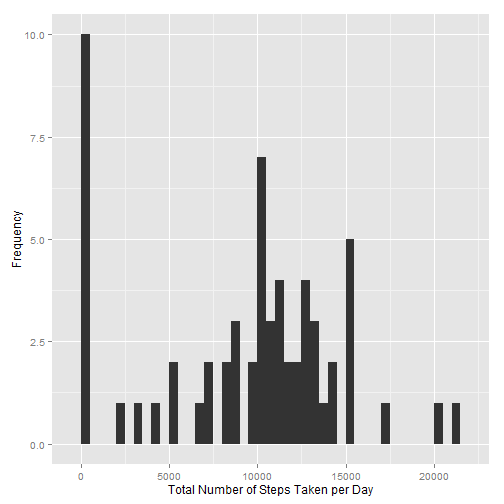
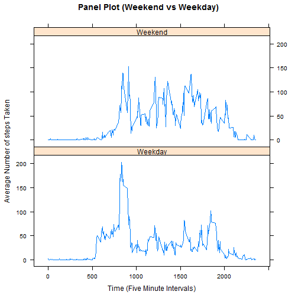

=============================================
Peer Assessment 1, Submitted By Tejdev Sandhu
=============================================
  
  
## Loading and preprocessing the data

The data for Peer Assessment 1 was obtained from the activity.zip file included in the RepData_PeerAssessment1 repository, from which I extracted activity.csv to my working directory. Although additional processing/transformation of the data is not necessary to proceed with the analysis, the ggplot2, Hmisc, and timeDate R packages must be installed.  


```r
setwd("C:/Users/TigerOne/Desktop/RepData_PeerAssessment1")
LoadedData <- read.csv("activity.csv")
```
  
  
## What is mean total number of steps taken per day?

First, I calculated the total number of steps taken per day.  


```r
TotalSteps <- tapply(LoadedData$steps, LoadedData$date, FUN=sum, na.rm=TRUE)
```

Second, I created a histogram using the ggplot2 package of the total number of steps taken per day.


```r
library(ggplot2)
qplot(TotalSteps, xlab = "Total Number of Steps Taken Per Day", ylab = "Frequency", binwidth=500)
```

 

Third, I calculated the mean and median of the total number of steps taken per day.


```r
StepMean <- mean(TotalSteps)
StepMedian <- median(TotalSteps)
```

The mean and median of the total number of steps taken per day are 9354.2295082 and 10395, respectively.
  
  
## What is the average daily activity pattern?

First, I made a five minute interval time series plot of the average number of steps taken, averaged across all days.


```r
IntervalMean <- aggregate(x=list(steps=LoadedData$steps), by=list(interval=LoadedData$interval), 
    FUN = mean, na.rm = TRUE)
plot(IntervalMean$interval, IntervalMean$steps, axes=F, type="l", col="red", xlab="Time (Five Minute Intervals)", ylab="Steps Taken (Averaged Across All Days)", main="Average Steps Taken By Five Minute Intervals")
axis(1, at=c(0, 600, 1200, 1800, 2400), label=c("0:00", "6:00", "12:00", 
    "18:00", "24:00"))
axis(2)
```

 

Second, I calculated the five minute interval, on average across all the days in the dataset, that contained the maximum number of steps.


```r
MaxCalculate <- which.max(IntervalMean[,2])
MaxInterval <- IntervalMean[MaxCalculate,]
```

The interval beginning at 835 has the maximum number of steps.
  
  
## Imputing missing values

First, I calculated the total number of missing values in the dataset (i.e. the total number of rows with NAs).


```r
MissingValues <- length(which(is.na(LoadedData$steps)))
```

There are 2304 missing values.  

Second, I created a new dataset with the missing data filled in.  To fill in the missing values, I devised the strategy of using the median value for that day.


```r
library(Hmisc)
FilledData <- LoadedData
FilledData$steps <- impute(LoadedData$steps, median)
```

Third, I created a new histogram based on the new dataset.


```r
TotalSteps2 <- tapply(FilledData$steps, FilledData$date, sum, TRUE)
qplot(TotalSteps2, xlab="Total Number of Steps Taken per Day", ylab="Frequency", binwidth=500)
```

 

Fourth, I calculated the mean and median total number of steps taken per day.


```r
StepMean2 <- mean(TotalSteps2)
StepMedian2 <- median(TotalSteps2)
```

The new mean and median of the total number of steps taken per day are 9355.2295082 and 1.0396 &times; 10<sup>4</sup>, respectively.  Although these new values are slightly higher than the old values, the impact of imputing the missing data using the median value was very small.
  
  
## Are there differences in activity patterns between weekdays and weekends?

First, using the timeDate package, I created a new factor variable in the dataset with two levels ("Weekend" and "Weekday") indicating whether a given date is a weekend day or weekday day.


```r
library(timeDate)
FilledData$DayType <- ifelse(isWeekend(FilledData$date), 'Weekend', 'Weekday')
```

Second, I made a panel plot containing a five minute interval time series plot of the average number of steps taken averaged across all weekend days and weekday days.


```r
IntervalMean2 <- aggregate(steps ~ interval + DayType, data=FilledData, mean)
library(lattice)

xyplot(IntervalMean2$steps ~ IntervalMean2$interval|IntervalMean2$DayType, main="Panel Plot (Weekend vs Weekday)", xlab="Time (Five Minute Intervals)", ylab="Average Number of steps Taken",layout=c(1,2), type="l")
```

 
